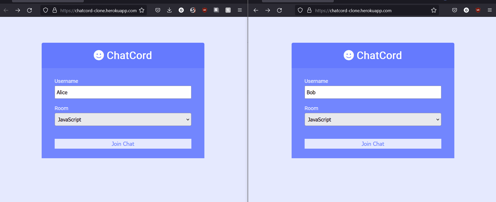

# Chatcord-Clone

<a href = "https://chatcord-clone.herokuapp.com/">

</a>

A realtime vanilla chat application that allows users to set up rooms. Built using Node.js, socket.io, JavaScript, HTML, CSS,

The project was developed by following [Brad Traversy's tutorial](https://www.youtube.com/watch?v=jD7FnbI76Hg). The project
was done to learn more about socket.io, server/client connections and Heroku deployment.

Website: https://chatcord-clone.herokuapp.com/

## Usage

```
npm install
npm run dev

Go to localhost:3000
```

## Chatcord-Clone Demo




